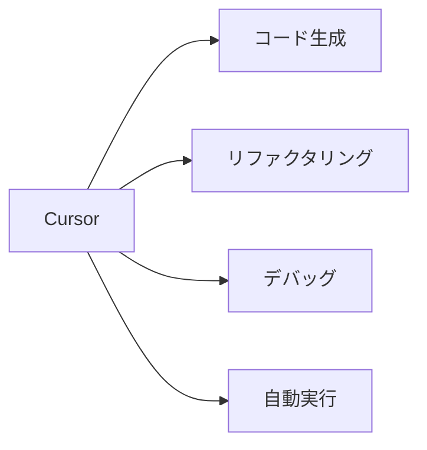
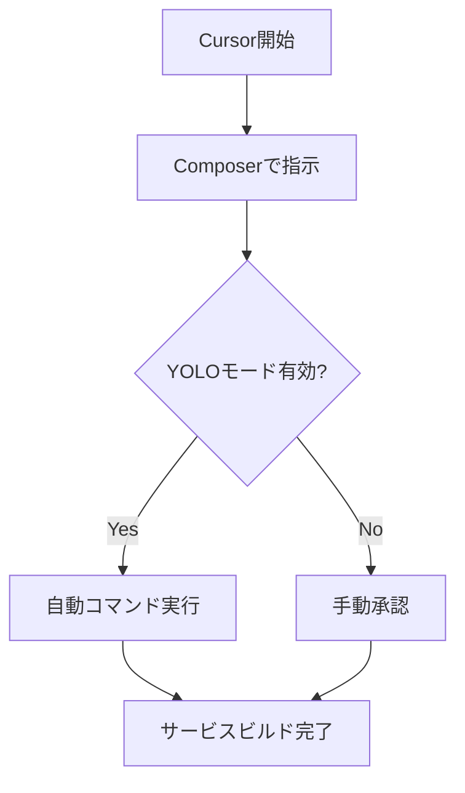
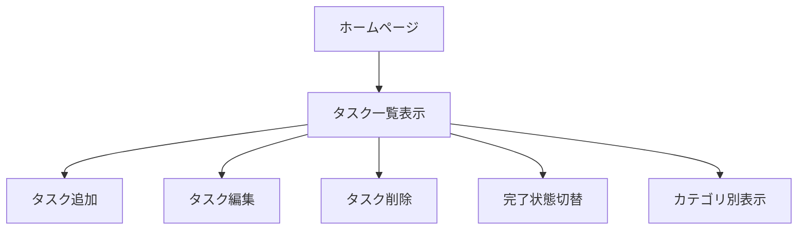

# CursorのAIを活用してサービスを自動構築する方法

この記事では、AI搭載コードエディタ「Cursor」のAgentモードとYOLOモードを活用して、指示だけでサービスを自動構築する方法を解説します。コード生成からアプリケーションのビルドまで、AIに依頼するだけで自動化する手順をご紹介します。

## Cursorとは

Cursorは、高度なAI機能を統合したコードエディタです。従来のエディタと違い、自然言語での指示に基づいてコード生成やプロジェクト構築が可能で、AIアシスタントと対話しながらプログラミングを進められます。



## Cursorを使ったサービスの自動構築

### 1. Cursorの初期設定

まずはCursorを効果的に使うための初期設定を行います。

#### Rules for AIの設定

1. Cursor Settingsを開く
2. Generalタブで「Rules for AI」に以下を設定

```
# Rules for AI
- TypeScriptとReactを使用すること
- ウェブ開発に関するベストプラクティスに従うこと
- エラー処理を適切に行うこと
- コメントは日本語で書くこと
- コードはシンプルで保守性の高いものにすること
```

#### YOLOモードの有効化

CursorのAgentモードとYOLOモード（自動コマンド実行）を有効にします。



1. Cursor Settings → Features → "Enable YOLO mode" をオン
2. 許可するコマンドを設定（npm, git関連コマンドなど）

### 2. Webアプリケーションの自動構築

#### ステップ1: プロジェクト作成の指示

Composerを開き（Ctrl+I または Cmd+I）、以下のような指示を入力：

```
Todoリスト管理のWebアプリケーションを構築してください。
要件:
- TypeScriptとNext.jsを使用
- ローカルストレージでデータ保存
- タスクの追加/編集/削除機能
- 完了状態の切り替え機能
- カテゴリ分け機能
- シンプルで使いやすいUI
```

#### ステップ2: Agentモードでの実行

指示を送信したら、右上の「Agent」タブをクリックします。YOLOモードが有効になっていれば、以下のようなコマンドが自動実行されます：

<!-- コマンド実行のイメージ図 -->
```
1. npm create next-app todo-app --typescript
2. cd todo-app
3. npm install tailwindcss postcss autoprefixer
4. npx tailwindcss init -p
5. ...
```

#### ステップ3: Todoアプリのコア機能実装

Agentモードで自動生成されるTodoアプリのコア部分は以下のようになります：

```typescript
// types/Todo.ts
export interface Todo {
  id: string;
  title: string;
  completed: boolean;
  category: string;
  createdAt: number;
}

// hooks/useTodos.ts
import { useState, useEffect } from 'react';
import { Todo } from '../types/Todo';

export const useTodos = () => {
  const [todos, setTodos] = useState<Todo[]>([]);

  // LocalStorageからデータ読み込み
  useEffect(() => {
    const storedTodos = localStorage.getItem('todos');
    if (storedTodos) {
      setTodos(JSON.parse(storedTodos));
    }
  }, []);

  // LocalStorageへの保存
  useEffect(() => {
    localStorage.setItem('todos', JSON.stringify(todos));
  }, [todos]);

  // Todo追加
  const addTodo = (title: string, category: string) => {
    const newTodo: Todo = {
      id: Date.now().toString(),
      title,
      completed: false,
      category,
      createdAt: Date.now(),
    };
    setTodos([...todos, newTodo]);
  };

  // Todo更新
  const updateTodo = (id: string, updatedTodo: Partial<Todo>) => {
    setTodos(
      todos.map(todo => 
        todo.id === id ? { ...todo, ...updatedTodo } : todo
      )
    );
  };

  // Todo削除
  const deleteTodo = (id: string) => {
    setTodos(todos.filter(todo => todo.id !== id));
  };

  return { todos, addTodo, updateTodo, deleteTodo };
};
```

### 3. 完成したアプリケーションの機能

自動生成されたTodoアプリは、以下の機能を持ちます：



- タスクの追加/編集/削除
- 完了状態の切り替え
- カテゴリによるフィルタリング
- ローカルストレージによるデータ保存
- レスポンシブデザイン

## YOLOモードでの自動ビルドの様子

実際にCursorのAgentモードとYOLOモードを使ってアプリケーションを自動構築する様子は以下のとおりです：

1. Composerでの指示：「Todoアプリを作って」
2. AIが要件を明確化：「どのような機能が必要ですか？」
3. 要件の詳細化：「タスクの追加、編集、削除、カテゴリ分け機能」
4. Agentモードでの自動実行開始
5. プロジェクト初期化とパッケージインストール
6. コンポーネント作成とロジック実装
7. スタイリングの適用
8. 動作確認とバグ修正
9. デプロイ準備

## Cursor自動ビルドの活用シーン

Cursorの自動ビルド機能は、以下のようなシーンで特に威力を発揮します：

| 活用シーン | メリット |
|------------|---------|
| プロトタイプ開発 | アイデアを素早く形にできる |
| ボイラープレートコード作成 | 定型的な初期設定を自動化 |
| レガシーコード更新 | 古いコードの現代化を支援 |
| 新技術の学習 | 実践的なコード例で学習効率向上 |
| 小〜中規模プロジェクト | 開発サイクルの短縮 |

## まとめ

この記事では、AIコードエディタ「Cursor」のAgentモードとYOLOモードを活用して、指示だけでサービスを自動構築する方法を解説しました。

Cursorの自動化機能を活用することで：
- コーディングの負担を大幅に軽減
- 開発の複雑さを抽象化
- 短時間で機能的なアプリケーションを構築

特に以下のような点がCursorの強みです：

1. **コンテキスト理解**: プロジェクト全体を理解した上でコード生成
2. **自動コマンド実行**: YOLOモードによる開発フローの自動化
3. **対話的な開発**: AIとの対話を通じた要件の明確化
4. **エラー自動修正**: 発生したエラーを自動的に修正

Cursorは特に開発の初期段階や、反復的なタスクを含むプロジェクトで、開発効率を飛躍的に向上させることができます。ぜひ自分のプロジェクトでも活用してみてください。

## 参考リソース

- [Cursor公式サイト](https://cursor.sh/)
- [Cursor GitHub](https://github.com/getcursor/cursor)
- [Claude 3.5 Sonnet（Cursorで使用されているAIモデル）](https://www.anthropic.com/claude)

---

ってClaude生成したら出てきました。。