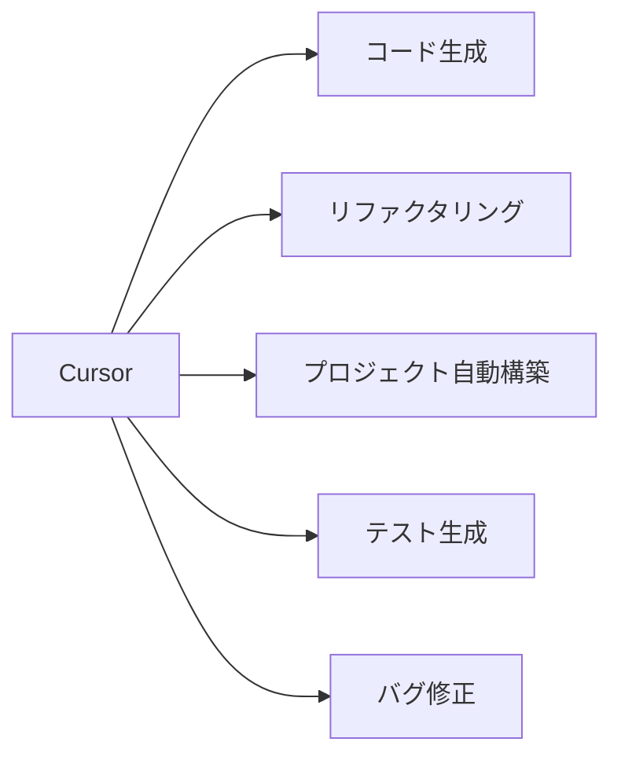

# CursorのAIを活用してサービスを自動構築する方法

この記事では、AI搭載コードエディタ「Cursor」のAgentモードとYOLOモードを活用して、指示だけでサービスを自動構築する方法を解説します。コード生成からアプリケーションのビルドまで、AIに依頼するだけで自動化する手順をご紹介します。

## Cursorとは

Cursorは、高度なAI機能を統合したコードエディタです。従来のエディタと違い、自然言語での指示に基づいてコード生成やプロジェクト構築が可能で、AIアシスタントと対話しながらプログラミングを進められます。



### Cursorの主な機能

- **コード生成**: 自然言語での指示からコードを生成
- **リファクタリング**: 既存コードの最適化と改善
- **デバッグ支援**: エラーの原因特定と修正提案
- **テスト生成**: ユニットテストの自動作成
- **ドキュメント生成**: コメントやREADMEの自動作成
- **プロジェクト構築**: アプリケーション全体の自動構築

## AIプログラミングの準備

### 必要な環境設定

Cursorでプロジェクトを自動構築するには、以下の環境を整えておく必要があります：

1. **Cursorのインストール**: [公式サイト](https://cursor.sh/)からダウンロード
2. **OpenAI APIキー**: 機能を最大限活用するために必要
3. **YOLOモードの有効化**: 設定メニューから有効にする
4. **開発環境**: Node.js、Python、Dockerなど、使用する技術に応じた環境

### YOLOモードの設定

YOLOモードは、AIにコマンド実行権限を与え、コードの生成から実行までを自動化するモードです。以下のように設定します：

1. Cursorの設定メニューから「AI」→「YOLO」を選択
2. 「Enable YOLO Mode」をオン
3. 「Terminal Commands Requiring Approval」をカスタマイズ
   - 全てのコマンドを許可する場合: 空白
   - 特定のコマンドのみ許可: 許可するコマンドのみリスト

```
# 許可するコマンド例
npm install, npm run, node, python, git add, git commit
```

4. 「Denied Commands」に危険なコマンドを追加
```
rm -rf /, sudo, chmod 777
```

## プロジェクト自動構築の手順

### ステップ1: プロジェクト要件の明確化

AIにプロジェクトを構築させる前に、以下の要素を明確にしておきましょう：

1. **目的**: アプリケーションの目的と機能
2. **技術スタック**: 使用する言語やフレームワーク
3. **アーキテクチャ**: システム設計の概要
4. **データモデル**: 必要なデータ構造

要件を明確にするほど、AIは適切なコードを生成できます。

### ステップ2: AIへの指示方法

AIへの指示は具体的かつ明確に行うことが重要です。以下は効果的な指示の例です：

```
Next.jsとPrismaを使用した、タスク管理アプリケーションを構築してください。
機能要件:
1. ユーザー認証（NextAuth.js使用）
2. タスクのCRUD操作
3. タスクのカテゴリ分け
4. 締め切り日の管理と通知
5. レスポンシブデザイン（TailwindCSS使用）

データモデル:
- User: id, name, email, password
- Task: id, title, description, dueDate, status, categoryId, userId
- Category: id, name, color, userId

最初に必要なパッケージをインストールし、プロジェクト構造を作成してください。
```

### ステップ3: Agentモードの活用

1. `Ctrl+K`（Mac: `Cmd+K`）でComposerを起動
2. 画面右上の「Agent」を選択
3. 上記のような詳細な指示を入力
4. 「Run」をクリックしてAIに実行させる

Agentモードでは、AIが自律的に以下のアクションを実行します：

1. プロジェクト構造の作成
2. 必要なパッケージのインストール
3. 各コンポーネントの実装
4. データベース設定
5. 基本的なUIの構築

### ステップ4: YOLOモードでの自動実装

YOLOモードを使うと、AIが自動的にコードを修正・実行しながら開発を進めます：

1. 自動コマンド実行: `npm install`や`npm run dev`などを自動実行
2. エラー検出と修正: 実行時エラーを検出し自動的に修正
3. 反復的改善: 目標達成までコードを繰り返し改善

例えば以下のような指示も可能です：

```
作成したタスク管理アプリに、以下の機能を追加実装してください:
1. タスクの優先度設定機能（高、中、低）
2. タスク検索機能
3. タグ付け機能

実装後、アプリケーションを起動して動作確認し、エラーがあれば修正してください。
```

## 高度な自動構築テクニック

### マルチファイルプロジェクトの効率的な構築

複雑なプロジェクトでは、以下のアプローチが効果的です：

1. **段階的構築**: 基本機能から順に実装
   ```
   まず認証機能とデータモデルを実装し、次にタスク管理機能、最後にUI改善を行ってください。
   ```

2. **アーキテクチャ指定**: 設計パターンを明示
   ```
   Clean Architectureに基づいて、domain、usecase、infrastructure、presentationの4層に分けて実装してください。
   ```

3. **コード品質指定**: 品質基準を設定
   ```
   TypeScriptの厳格な型チェック（strict: true）を有効にし、ESLintとPrettierを設定してください。
   ```

### デプロイまでの自動化

YOLOモードを活用すれば、デプロイ準備まで自動化できます：

1. **ビルドプロセス**:
   ```
   本番環境用にビルドし、最適化してください。Dockerコンテナも作成し、docker-compose.ymlも用意してください。
   ```

2. **テスト作成と実行**:
   ```
   Jestを使用してユニットテストとE2Eテストを作成し、実行してください。カバレッジレポートも生成してください。
   ```

3. **CI/CD設定**:
   ```
   GitHub Actionsを使用して、テスト、ビルド、デプロイの自動化ワークフローを構築してください。
   ```

## 実際の自動構築例

### 例1: ブログアプリケーション

以下の指示から始めて、完全なブログアプリケーションを自動構築できます：

```
Next.js、TypeScript、TailwindCSS、Prisma、NextAuthを使用したブログアプリケーションを構築してください。
機能:
1. ユーザー登録・ログイン
2. 記事の作成・編集・削除
3. カテゴリとタグ管理
4. コメント機能
5. マークダウンエディタ
6. 画像アップロード

ステップバイステップで実装を進め、各ステップで動作確認してください。
```

AIはこの指示から、プロジェクト設定、データモデル作成、API実装、フロントエンド構築まで順番に進めていきます。

### 例2: ECサイト

```
Next.js、TypeScript、Stripeを使用したECサイトを構築してください。
機能:
1. 商品一覧・詳細表示
2. カート機能
3. Stripe決済統合
4. 注文履歴
5. 管理画面（商品管理）

最初にプロジェクト構造を作成し、次に各機能を実装してください。
```

## トラブルシューティング

自動構築中に発生しやすい問題と解決策：

1. **依存関係エラー**:
   - 問題: パッケージの互換性問題
   - 解決: `AIに特定バージョンのインストールを指示する`

2. **生成コードの品質**:
   - 問題: 意図通りでないコード生成
   - 解決: `より詳細な要件や具体例を提示する`

3. **実行タイムアウト**:
   - 問題: 大規模プロジェクトでの処理時間超過
   - 解決: `タスクを小さく分割して段階的に指示する`

4. **コマンド権限**:
   - 問題: YOLOモードでのコマンド実行制限
   - 解決: `設定で許可するコマンドを追加する`

## まとめ

CursorのAI機能を活用することで、プロジェクトの自動構築が可能になります。特にAgentモードとYOLOモードを組み合わせることで、コード生成から実行、デバッグまでをAIに任せることができます。

効果的な活用のポイント：

1. 詳細かつ具体的な指示
2. 段階的な開発アプローチ
3. 適切なYOLOモード設定
4. フィードバックとレビュー

AIはあくまでツールであり、最終的な品質確認と調整は人間が行うことで、高品質なサービスを効率的に構築できます。

今後、AIの性能向上により、さらに複雑なプロジェクトも自動構築できるようになるでしょう。Cursorの機能を使いこなし、開発効率を大幅に向上させましょう。

## 参考リソース

- [Cursor公式サイト](https://cursor.sh/)
- [Cursor GitHub](https://github.com/getcursor/cursor)
- [Claude 3.5 Sonnet（Cursorで使用されているAIモデル）](https://www.anthropic.com/claude)

---

ってClaude生成したら出てきました。。